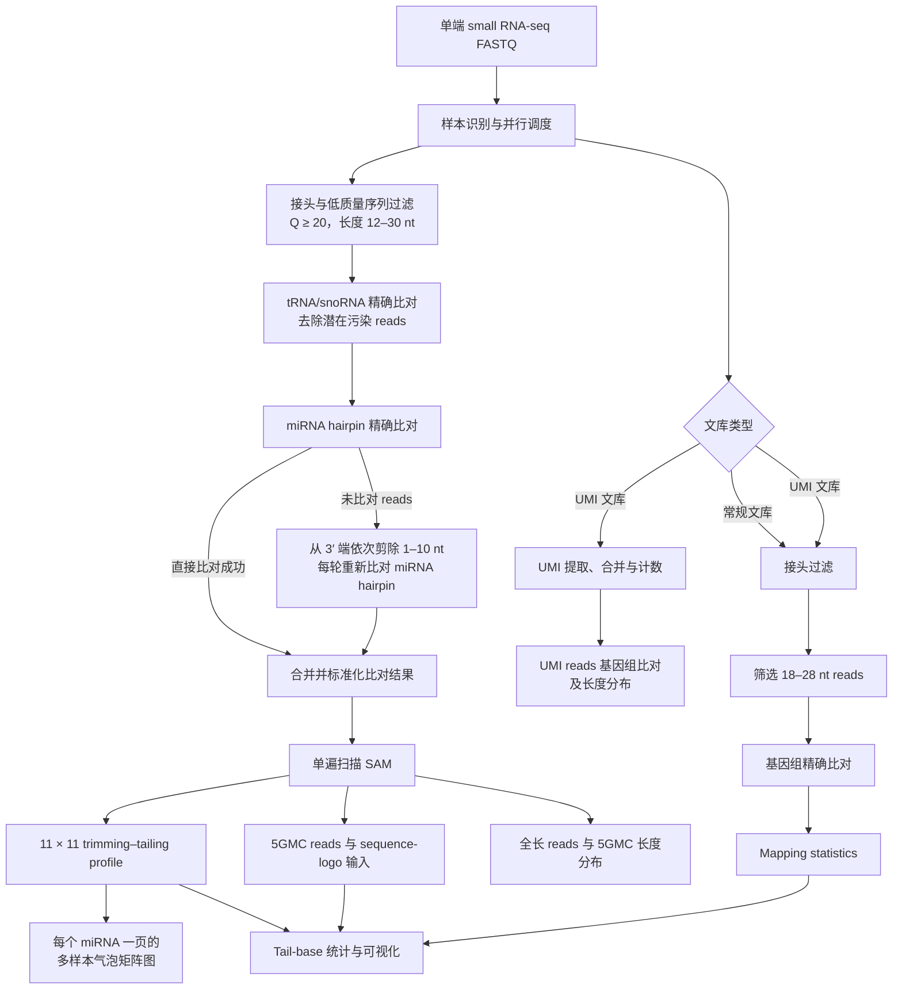

# Parallel miRNA tailing/trimming workflow

## 概述

miRNA 3′ 末端的非模板加尾（non-templated tailing）与核苷酸剪切（trimming）是
影响 miRNA 稳定性、降解及功能调控的重要转录后修饰。本流程面向植物单端 small
RNA-seq 数据，旨在系统识别并定量 miRNA 3′ 末端的加尾和剪切事件，同时描述不同
修饰长度、末端碱基组成及其在样本间的分布特征。

流程首先对原始 FASTQ reads 进行接头去除、质量控制和长度筛选，并通过与
tRNA/snoRNA 参考序列的精确比对去除潜在污染。过滤后的 reads 随后比对至 miRNA hairpin
参考序列。对于无法直接比对的 reads，流程从其 3′ 端依次剪除 1–10 nt，并在每次
剪切后重新比对，以恢复可能含有非模板末端修饰的 miRNA reads。根据 read 的原始
长度、剪切长度、比对起点以及注释 miRNA 的成熟序列边界，构建每条 miRNA 的
trimming–tailing profile，并进一步统计 5GMC、末端碱基类型和长度分布。

除 miRNA 末端修饰分析外，本流程还提供常规及 UMI small RNA 文库的基因组比对、
mapping statistics 汇总、全长 reads 与 5GMC 长度分布，以及 tail-base 统计表和
可视化结果。样本级并行调度与单样本线程控制相互独立，可用于多样本 small RNA-seq
项目的批量分析。

本项目由 `renlab_tailing_trimming_20240111` 重构而来。在保持核心统计定义和主要
分析参数不变的基础上，将原先分散于多个目录的 Python 和 R 分析逻辑整合到当前
仓库，并以单遍 SAM 扫描替代重复扫描策略。Bowtie 索引及 `resources/` 参考表作为
本地参考数据单独提供，不纳入 Git 版本管理。

### 分析流程



### 主要输出

- 每条 miRNA 的 11 × 11 trimming–tailing profile
- 多样本并排的 trimming–tailing 气泡矩阵多页 PDF
- miRNA 总 reads、1–10 nt 加尾及剪切事件的汇总统计
- 5GMC reads 及 sequence-logo 输入文件
- 全长 reads 和 5GMC 的长度分布工作簿
- 不同末端碱基及修饰长度的计数、比例和 RPM 结果
- 常规或 UMI small RNA 的基因组比对结果及 mapping statistics

## 相比原版本的提升

| 项目 | 原版本 | 新版本 |
| --- | --- | --- |
| 项目结构 | 运行时引用 `TRMRNAseqTools/0_workflow_for_srna_seq.py` 等外部脚本 | 已将相关逻辑和 R 脚本整合到本仓库；参考表放在本地 `resources/`，不由 Git 跟踪 |
| 多样本运行 | 主要按样本串行处理 | 使用 `--jobs` 控制样本级并行，可同时处理多个样本 |
| 资源控制 | 工具线程数分散在不同脚本中 | 使用 `--threads-per-sample` 统一控制单样本线程数，总线程数约为 `jobs × threads-per-sample` |
| profile 统计 | Perl 针对每条 miRNA 重复扫描 SAM，共进行 538 次全文件扫描 | Python 单遍扫描 SAM，同时生成 profile、summary 和 5GMC 结果 |
| 中断续跑 | 需要手动判断已完成步骤 | `--resume` 根据最终输出跳过已完成的样本和步骤 |
| 运行前检查 | 缺少统一预览入口 | `--dry-run` 可预览样本、参数、索引及待执行命令 |
| 外部依赖 | 依赖外部 Python/Perl 脚本，并使用部分非必要工具 | 移除 Perl、`seqkit` 和 `dnapilib` 依赖；保留流程必需的软件及 Bowtie 索引 |
| 日志与报错 | 多层脚本调用，定位失败步骤较困难 | 统一入口、分步骤日志和样本级错误信息，便于排查及重跑 |

### 性能优化

耗时最明显的优化位于 `profile` 步骤。旧实现会针对 538 个 miRNA 分别重读一次
SAM；新实现只遍历一次 SAM，并在同一过程中完成全部统计。测试中，一个约 1.2 GB
的 SAM 文件可在约 37 秒内完成该步骤。新旧版本生成的 profile、summary 和 5GMC
三个关键结果已进行逐字节比较，结果一致。

FASTQ 和 SAM 均采用流式读取，避免把整个大文件一次性载入内存。R 汇总脚本也对
稀疏碱基统计进行了调整，降低无效数据展开造成的额外开销。

### 并行方式

并行以“样本”为单位：`--jobs` 表示最多同时处理的样本数，
`--threads-per-sample` 表示每个样本调用 Bowtie 等工具时可使用的线程数。例如：

```bash
python3 main.py -i 1_rawdata -o results --jobs 2 --threads-per-sample 8
```

该配置最多同时运行 2 个样本，总 CPU 需求约为 16 线程。这样既能提升多样本吞吐量，
也能避免为每个样本无限制启动进程。

### 独立性和可复现性

原流程引用的外部小 RNA workflow、统计逻辑和 R 脚本已经纳入当前仓库，不再需要
保持原服务器上的脚本目录结构。`resources/` 已加入 `.gitignore`，服务器本地文件会
保留，但不会上传到 GitHub；新环境需要自行准备这些参考表，或分别通过
`--meta-file`、`--mechanism-file` 和 `--sequence-merge-file` 指定。Bowtie 索引体积
较大，同样作为外部参考数据通过命令行参数指定，不提交到 Git 仓库。

流程已完成 Python/R 语法检查、dry-run 检查、双样本并行测试，以及长度分布和
tail-base 汇总测试。上述测试用于确认调度、续跑和主要输出生成逻辑可以正常工作；
正式分析前仍建议先用少量代表性样本验证本机的软件版本、索引路径和资源配置。

## 运行环境

- Python 3.8+
- Python 包见 `requirements.txt`
- 命令行工具：`trim_galore`、`bowtie`、`Rscript`
- R 包：`tidyverse`、`openxlsx`、`data.table`、`reshape2`、`lubridate`
- tail-base 默认使用旧流程中的 `/usr/local/bin/Rscript`；可通过 `--rscript` 覆盖
- Bowtie 索引仍属于大型参考数据，通过参数指定，不复制进代码目录

## 快速开始

```bash
python3 main.py \
  -i /path/to/1_rawdata \
  -o /path/to/project \
  --jobs 2 \
  --threads-per-sample 8
```

总线程需求约为 `jobs × threads-per-sample`。建议第一次使用 `--jobs 2`，确认
内存和 CPU 负载后再增加。

输入文件默认匹配 `*.fastq.gz`。样本名由文件名去除 `--suffix` 后得到，并将连字符
`-` 统一转换为下划线 `_`。如果文件名为 `sample_R1.fastq.gz`，可使用：

```bash
python3 main.py -i 1_rawdata -o results --suffix _R1.fastq.gz
```

## 分步运行

步骤顺序为：

1. `preprocess`：接头过滤以及 miRNA tailing/trimming remapping
2. `profile`：单遍扫描 SAM，生成 163 profile 和 5GMC 汇总；替代旧版对每条
   miRNA 重读一次 SAM 的 Perl 实现
3. `bubble`：将全部样本并排绘制为 trimming–tailing 气泡矩阵，每个 miRNA 一页
4. `srna`：常规或 UMI 小 RNA genome mapping
5. `mapping_summary`：汇总 Bowtie 日志
6. `length`：生成每个样本的长度分布工作簿
7. `tailbase`：生成 tail base R 统计和图表

例如只运行前两个步骤：

```bash
python3 main.py -i 1_rawdata -o results --steps preprocess,profile -j 2
```

已有 profile 结果时，可单独生成类似 `new.pdf` 的多页气泡图：

```bash
python3 main.py \
  -o results \
  --steps bubble \
  --filelist filelist \
  --bubble-cols 2
```

默认输出为
`5_GMC_analysis/plot_bubble/tailing_trimming_bubble.pdf`。`--bubble-cols` 控制每行
显示的样本数，`--bubble-output` 可指定 PDF 路径。

从已有 `3_remapping/<sample>/` 继续运行时，可以省略原始 FASTQ，或用
`--filelist` 指定样本。`--resume` 会根据每一步的最终输出跳过已完成样本；
`--dry-run` 用于检查样本、参数、索引和即将执行的命令。

UMI 文库使用 `--umi-flag 1`，普通小 RNA 文库使用默认值 `2`。

## 目录内容

```text
main.py                 统一入口和步骤调度
pipeline/               Python 实现；样本级受控并行
pipeline/bubble.py      多样本 trimming–tailing 气泡矩阵图
assets/tail_base_summary.R  本地 R 汇总脚本
resources/              R/Python 所需的本地参考表（Git 忽略）
requirements.txt        Python 依赖
```

默认的拟南芥 Bowtie 索引可以通过 `--mir-hairpin`、`--trsno` 和
`--genome-index` 覆盖。运行 `python3 main.py --help` 查看全部参数。
