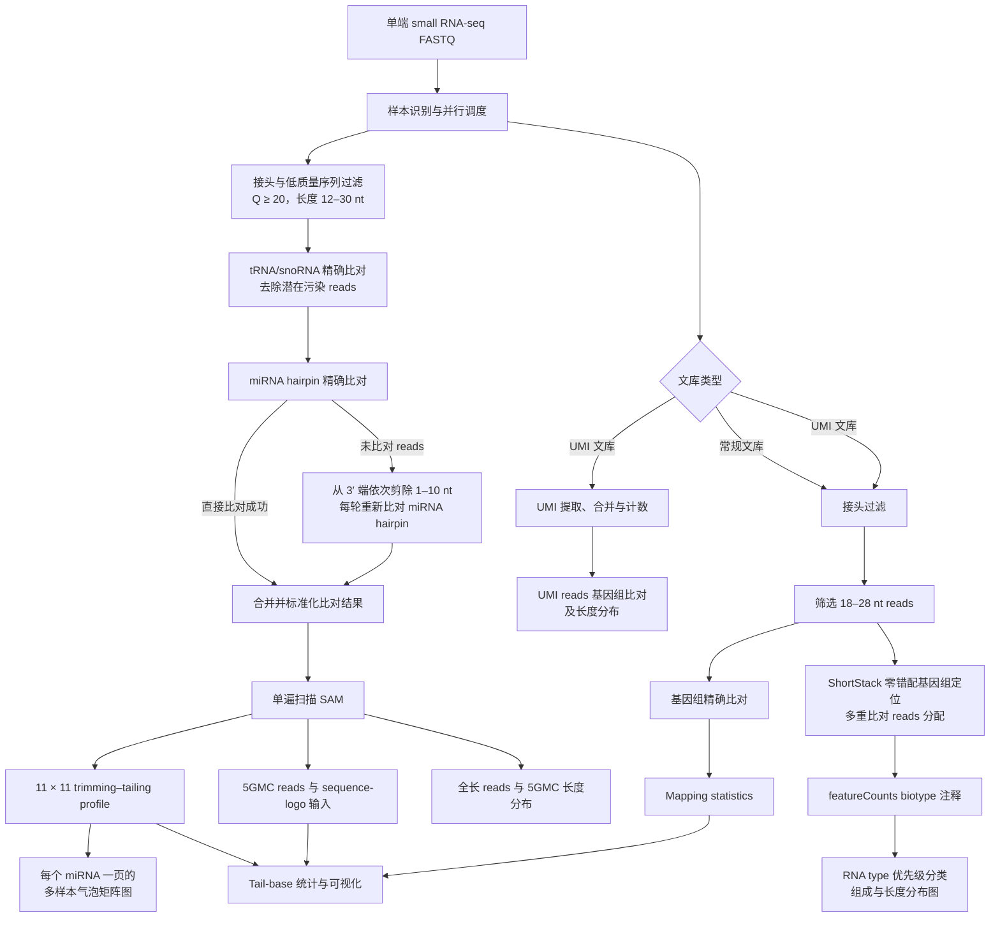
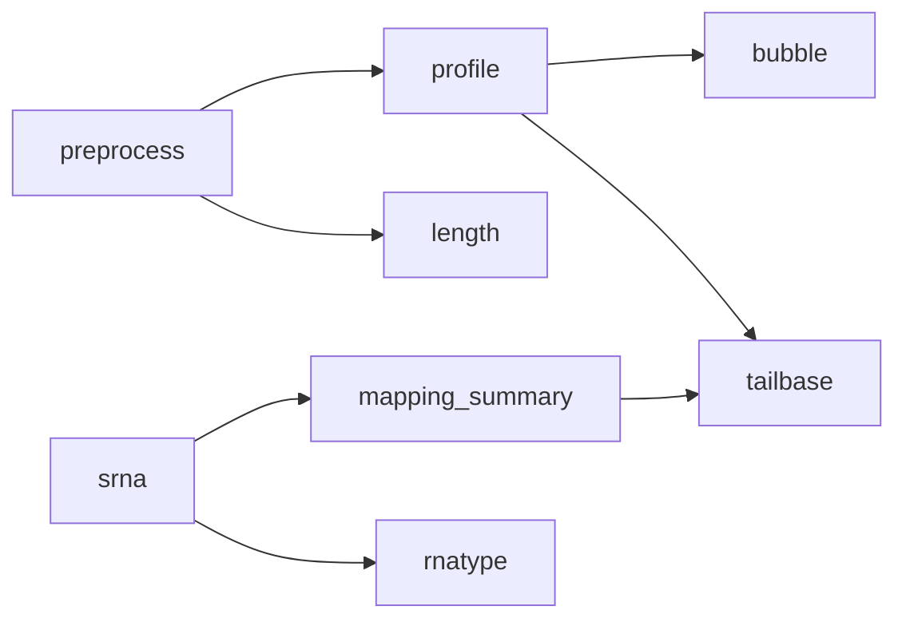
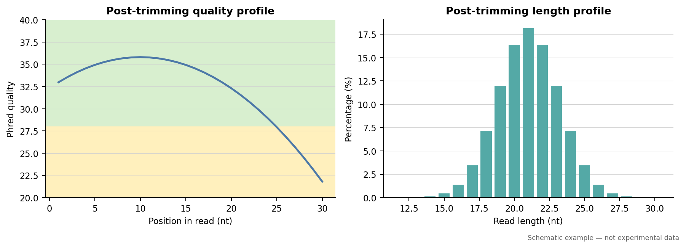
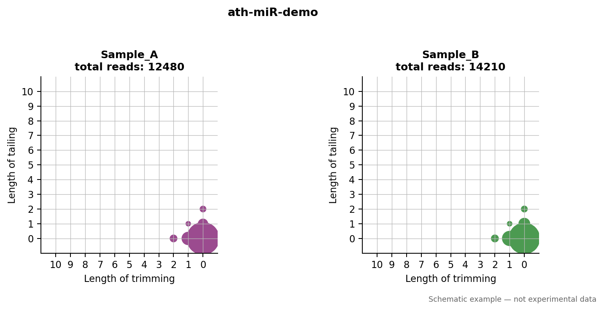
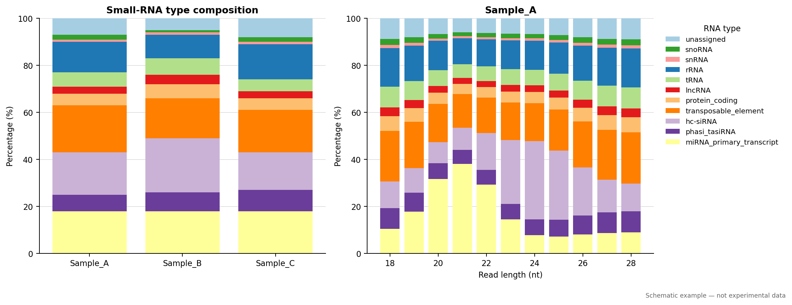
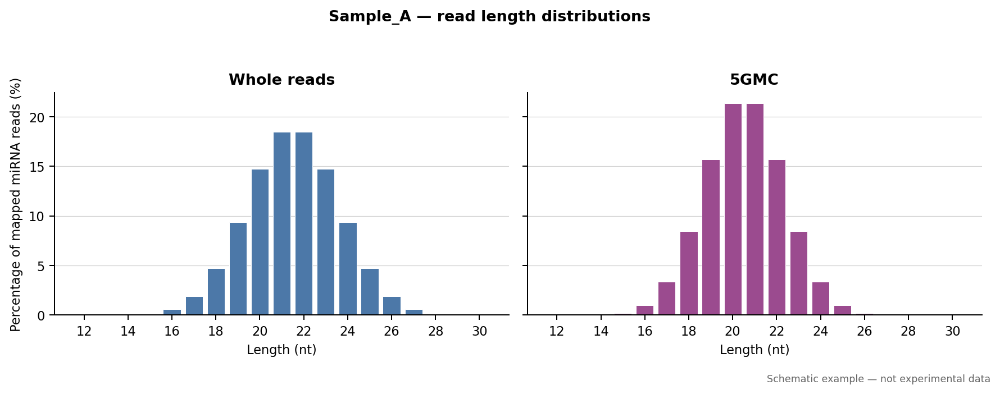
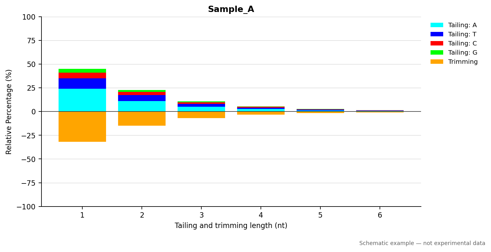

# Parallel miRNA tailing/trimming workflow

## 概述

miRNA 3′ 末端的非模板加尾（non-templated tailing）与核苷酸剪切（trimming）是
影响 miRNA 稳定性、降解及功能调控的重要转录后修饰。本流程面向植物单端 small
RNA-seq 数据，旨在系统识别并定量 miRNA 3′ 末端的加尾和剪切事件，同时描述不同
修饰长度、末端碱基组成及其在样本间的分布特征。

流程首先对原始 FASTQ reads 进行接头去除、质量控制和长度筛选，并通过与
tRNA/snoRNA 参考序列的精确比对去除潜在污染。过滤后的 reads 随后比对至 miRNA hairpin
参考序列。对于无法直接比对的 reads，流程从其 3′ 端依次剪除 1–10 nt，并在每次
剪切后重新比对，以恢复可能含有非模板末端修饰的 miRNA reads。根据 read 的原始
长度、剪切长度、比对起点以及注释 miRNA 的成熟序列边界，构建每条 miRNA 的
trimming–tailing profile，并进一步统计 5GMC、末端碱基类型和长度分布。

除 miRNA 末端修饰分析外，本流程还提供常规及 UMI small RNA 文库的基因组比对、
mapping statistics 汇总、全长 reads 与 5GMC 长度分布，以及 tail-base 统计表和
可视化结果。流程还可利用 ShortStack 对 18–28 nt reads 进行零错配基因组定位和
多重比对分配，再通过 featureCounts 与 GFF3 biotype 注释计算文库 RNA type 组成。
样本级并行调度与单样本线程控制相互独立，可用于多样本 small RNA-seq 项目的批量分析。

本项目由 `renlab_tailing_trimming_20240111` 重构而来。在保持核心统计定义和主要
分析参数不变的基础上，将原先分散于多个目录的 Python 和 R 分析逻辑整合到当前
仓库，并以单遍 SAM 扫描替代重复扫描策略。Bowtie 索引及 `resources/` 参考表作为
本地参考数据单独提供，不纳入 Git 版本管理。

### 分析流程



### 主要输出

- 每条 miRNA 的 11 × 11 trimming–tailing profile
- 多样本并排的 trimming–tailing 气泡矩阵多页 PDF
- miRNA 总 reads、1–10 nt 加尾及剪切事件的汇总统计
- 5GMC reads 及 sequence-logo 输入文件
- 全长 reads 和 5GMC 的长度分布工作簿及样本级双面板 PDF
- 不同末端碱基及修饰长度的计数、比例和 RPM 结果
- 常规或 UMI small RNA 的基因组比对结果及 mapping statistics
- ShortStack 定位后的 RNA type 计数、比例、长度分布及多样本组成图

## 相比原版本的提升

| 项目 | 原版本 | 新版本 |
| --- | --- | --- |
| 项目结构 | 运行时引用 `TRMRNAseqTools/0_workflow_for_srna_seq.py` 等外部脚本 | 已将相关逻辑和 R 脚本整合到本仓库；参考表放在本地 `resources/`，不由 Git 跟踪 |
| 多样本运行 | 主要按样本串行处理 | 使用 `--jobs` 控制样本级并行，可同时处理多个样本 |
| 资源控制 | 工具线程数分散在不同脚本中 | 使用 `--threads-per-sample` 统一控制单样本线程数，总线程数约为 `jobs × threads-per-sample` |
| profile 统计 | Perl 针对每条 miRNA 重复扫描 SAM，共进行 538 次全文件扫描 | Python 单遍扫描 SAM，同时生成 profile、summary 和 5GMC 结果 |
| 中断续跑 | 需要手动判断已完成步骤 | `--resume` 根据最终输出跳过已完成的样本和步骤 |
| 运行前检查 | 缺少统一预览入口 | `--dry-run` 可预览样本、参数、索引及待执行命令 |
| 外部依赖 | 依赖外部 Python/Perl 脚本，并使用部分非必要工具 | 移除 Perl、`seqkit` 和 `dnapilib` 依赖；保留流程必需的软件及 Bowtie 索引 |
| 日志与报错 | 多层脚本调用，定位失败步骤较困难 | 统一入口、分步骤日志和样本级错误信息，便于排查及重跑 |

### 性能优化

耗时最明显的优化位于 `profile` 步骤。旧实现会针对 538 个 miRNA 分别重读一次
SAM；新实现只遍历一次 SAM，并在同一过程中完成全部统计。测试中，一个约 1.2 GB
的 SAM 文件可在约 37 秒内完成该步骤。新旧版本生成的 profile、summary 和 5GMC
三个关键结果已进行逐字节比较，结果一致。

FASTQ 和 SAM 均采用流式读取，避免把整个大文件一次性载入内存。R 汇总脚本也对
稀疏碱基统计进行了调整，降低无效数据展开造成的额外开销。

### 并行方式

并行以“样本”为单位：`--jobs` 表示最多同时处理的样本数，
`--threads-per-sample` 表示每个样本调用 Bowtie 等工具时可使用的线程数。例如：

```bash
python3 main.py -i 1_rawdata -o results --jobs 2 --threads-per-sample 8
```

该配置最多同时运行 2 个样本，总 CPU 需求约为 16 线程。这样既能提升多样本吞吐量，
也能避免为每个样本无限制启动进程。

### 独立性和可复现性

原流程引用的外部小 RNA workflow、统计逻辑和 R 脚本已经纳入当前仓库，不再需要
保持原服务器上的脚本目录结构。`resources/` 已加入 `.gitignore`，服务器本地文件会
保留，但不会上传到 GitHub；新环境需要自行准备这些参考表，或分别通过
`--meta-file`、`--mechanism-file` 和 `--sequence-merge-file` 指定。Bowtie 索引体积
较大，同样作为外部参考数据通过命令行参数指定，不提交到 Git 仓库。

流程已完成 Python/R 语法检查、dry-run 检查、双样本并行测试，以及长度分布和
tail-base 汇总测试。上述测试用于确认调度、续跑和主要输出生成逻辑可以正常工作；
正式分析前仍建议先用少量代表性样本验证本机的软件版本、索引路径和资源配置。

## 运行环境

- Python 3.8+
- Python 包见 `requirements.txt`
- 命令行工具：`trim_galore`、`bowtie`、`ShortStack`、`featureCounts`、`Rscript`
- R 包：`tidyverse`、`openxlsx`、`data.table`、`reshape2`、`lubridate`
- tail-base 默认使用旧流程中的 `/usr/local/bin/Rscript`；可通过 `--rscript` 覆盖
- Bowtie 索引仍属于大型参考数据，通过参数指定，不复制进代码目录

## 快速开始

```bash
python3 main.py \
  -i /path/to/1_rawdata \
  -o /path/to/project \
  --jobs 2 \
  --threads-per-sample 8
```

总线程需求约为 `jobs × threads-per-sample`。建议第一次使用 `--jobs 2`，确认
内存和 CPU 负载后再增加。

输入文件默认匹配 `*.fastq.gz`。样本名由文件名去除 `--suffix` 后得到，并将连字符
`-` 统一转换为下划线 `_`。如果文件名为 `sample_R1.fastq.gz`，可使用：

```bash
python3 main.py -i 1_rawdata -o project_output --suffix _R1.fastq.gz
```

## 输出目录

新项目默认将可重建的中间文件放入 `work/`，将用于检查、统计和发表的结果放入
`results/`。两条分析分支分别存放，避免编号目录相互混杂：

```text
project_output/
├── work/
│   ├── tailing_trimming/
│   │   ├── trimmed_fasta/
│   │   └── remapping/<sample>/
│   └── srna/
│       ├── trimmed/
│       ├── umi/
│       └── genome_mapping/
└── results/
    ├── tailing_trimming/
    │   ├── profiles/
    │   ├── 5gmc/
    │   ├── sequence_logo/
    │   ├── length/
    │   │   ├── <sample>_len_dist.xlsx
    │   │   └── plots/<sample>_length_distribution.pdf
    │   ├── bubble/tailing_trimming_bubble.pdf
    │   └── tailbase/
    │       ├── tables/<sample>/
    │       ├── plots/<sample>/
    │       └── workspace/
    └── srna/
        ├── mapping_summary.tsv
        └── rnatype/
            ├── rnatype_summary.tsv
            ├── rnatype_summary.xlsx
            ├── tables/<sample>_rnatype_by_length.tsv
            └── plots/
                ├── rnatype_composition.pdf
                ├── rnatype_composition.png
                └── <sample>_rnatype_by_length.pdf
```

`--layout auto` 是默认设置：新项目采用上述结构；如果检测到旧版的
`3_remapping/` 或 `4_163.results/`，则继续使用原目录，避免重复计算。也可以显式
使用 `--layout organized` 或 `--layout legacy`。

## 分步运行、功能与结果解读

流程可拆分为 8 个步骤。下表中的“直接图形”仅表示该步骤本身是否产图；不直接产图的
步骤通常生成后续统计和绘图所需的标准化中间结果。

| 步骤 | 主要功能 | 前置结果 | 直接图形 |
| --- | --- | --- | --- |
| `preprocess` | miRNA 分支质控、污染过滤和逐级 3′ remapping | 原始 FASTQ | FastQC HTML |
| `profile` | 构建 11 × 11 修剪–加尾矩阵、summary、5GMC 和 sequence-logo 输入 | `preprocess` | 不直接产图 |
| `bubble` | 按 miRNA 绘制多样本修剪–加尾气泡矩阵 | `profile` | 多页 PDF |
| `srna` | 常规/UMI 文库处理、18–28 nt 筛选和基因组比对 | 原始 FASTQ | FastQC HTML |
| `mapping_summary` | 汇总 Bowtie 日志中的总 reads、mapped reads 和比对率 | `srna` | 不直接产图 |
| `rnatype` | ShortStack 定位、featureCounts 注释和唯一 RNA type 分类 | `srna` | RNA type 组成图和长度分布图 |
| `length` | 统计 miRNA 全长 reads 与 5GMC 的长度分布 | `preprocess` | Excel 内嵌图和样本级 PDF |
| `tailbase` | 汇总 trimming、总体 tailing 和非模板 tailing 的长度及碱基组成 | `profile`、`mapping_summary` | 每个样本 2 个 PDF |



以下图片均由固定的匿名示意数据生成，仅用于说明图形结构，不代表真实样本或预期的
生物学分布。可运行 `python3 docs/generate_demo_figures.py` 重新生成 README 示例图。

### 1. `preprocess`：miRNA 末端修饰预处理与 remapping

该步骤使用 Trim Galore 去接头、去除低质量及含 `N` 的 reads，并保留 12–30 nt
序列。reads 首先精确比对 tRNA/snoRNA 参考以去除潜在污染，再精确比对 miRNA
hairpin；未比对序列从 3′ 端逐次剪除 1–10 nt 后重新比对。最终合并为带有剪切信息的
SAM，供后续 profile 与长度分析使用。

```bash
python3 main.py -i 1_rawdata -o project_output --steps preprocess -j 2
```

主要结果：

- `work/tailing_trimming/trimmed_fasta/<sample>_trimmed_fastqc.html`：去接头后 FastQC 报告
- `work/tailing_trimming/trimmed_fasta/<sample>_trimmed.fasta`：格式化的 reads
- `work/tailing_trimming/remapping/<sample>/merged-alignment-sorted.sam`：合并后的核心比对结果
- `work/tailing_trimming/remapping/<sample>/remapping.log`：tRNA/snoRNA 和 miRNA 比对日志

FastQC 报告用于检查碱基质量、接头残留、序列长度和高频序列。README 中的简化示例如下；
正式分析应打开每个样本对应的交互式 HTML 报告。



### 2. `profile`：修剪–加尾矩阵与 5GMC 提取

该步骤单遍扫描每个样本的合并 SAM，并依据 mature miRNA 的起止位置，将 reads 归入
0–10 nt trimming 与 0–10 nt tailing 的 11 × 11 矩阵。同时提取 5′ genomic matching
component（5GMC）reads，并生成 sequence-logo 输入和按 miRNA 汇总的计数表。

```bash
python3 main.py -o project_output --steps profile --resume
```

主要结果：

- `results/tailing_trimming/profiles/<sample>.txt`：样本完整 profile
- `results/tailing_trimming/profiles/<sample>.summary.txt`：总量、trimming 和 1–10 nt tailing 汇总
- `results/tailing_trimming/profiles/<sample>/<miRNA>.txt`：单个 miRNA 的 11 × 11 矩阵
- `results/tailing_trimming/5gmc/<sample>.5GMC`：5GMC reads
- `results/tailing_trimming/sequence_logo/<sample>/`：每个 miRNA 的 sequence-logo 输入

本步骤不直接生成图片。单 miRNA 矩阵由 `bubble` 可视化，5GMC 则由 `length` 和
`tailbase` 用于后续统计。

### 3. `bubble`：多样本 trimming–tailing 气泡图

该步骤将同一 miRNA 在多个样本中的 11 × 11 profile 并排绘制。横轴为 trimming
长度，纵轴为 tailing 长度，圆面积表示该组合在当前 miRNA profile 中的相对 read
比例。PDF 每页对应一个 miRNA，适合逐个比较样本间的末端修饰模式。

```bash
python3 main.py \
  -o project_output \
  --steps bubble \
  --filelist filelist \
  --bubble-cols 2
```

主要结果：`results/tailing_trimming/bubble/tailing_trimming_bubble.pdf`。`--bubble-cols`
控制每行样本数，`--bubble-output` 可覆盖输出路径。



### 4. `srna`：small RNA 文库处理与基因组比对

普通文库完成接头过滤后，保留 18–28 nt reads 并使用 Bowtie 对基因组进行零错配比对。
UMI 文库还会识别 linker、提取 12 nt UMI、合并相同 insert–UMI 组合，并另行输出 UMI
reads 的比对和长度统计。`--umi-flag 1` 表示 UMI 文库，默认值 `2` 表示普通文库。

```bash
python3 main.py -i 1_rawdata -o project_output --steps srna --umi-flag 2 -j 2
```

主要结果：

- `work/srna/trimmed/<sample>_trimmed_fastqc.html`：small RNA 分支 FastQC 报告
- `work/srna/genome_mapping/<sample>_trimmed_len.fq.gz`：18–28 nt reads
- `work/srna/genome_mapping/<sample>_aligned.sam`：基因组比对结果
- `work/srna/genome_mapping/<sample>.mapresults.txt`：Bowtie 比对日志
- UMI 模式下的 `work/srna/umi/<sample>_umi.fa.gz`、比对结果和 `<sample>_umi_dist.csv`

本步骤的直接图形仍为 FastQC HTML，其图形结构可参考步骤 1；UMI 长度输出为 TSV/CSV
统计表，不自动生成 PDF。

### 5. `mapping_summary`：基因组比对统计汇总

该步骤解析所有样本的 Bowtie 日志，统一汇总输入 reads 数、至少一次成功比对的 reads
数、比对率和 Bowtie reported alignment 数。它用于项目级质控，也是 `tailbase` 计算
标准化指标时的输入之一。

```bash
python3 main.py -o project_output --steps mapping_summary
```

主要结果为 `results/srna/mapping_summary.tsv`，包含 `Sample`、`Total_reads`、
`Mapped_reads`、`Mapped_rate(%)` 和 `Reported` 五列。本步骤不直接绘图，以便用户按实验
设计自行制作跨样本 QC 图或纳入统计报告。

### 6. `rnatype`：RNA type 分类与组成可视化

该步骤将 18–28 nt reads 经 ShortStack 零错配定位和多重比对分配后，使用
featureCounts 根据 GFF3 `biotype` 注释，并按预设优先级为每条已定位 read 确定唯一
RNA type。图中颜色与图例类别一一对应，堆叠从上到下遵循图例顺序；纵坐标统一为
`Percentage (%)`。

```bash
python3 main.py \
  -i 1_rawdata \
  -o project_output \
  --steps srna,rnatype \
  --jobs 2 \
  --threads-per-sample 8
```

主要结果：

- `results/srna/rnatype/rnatype_summary.tsv` 和 `.xlsx`：跨样本 RNA type 汇总
- `results/srna/rnatype/tables/<sample>_rnatype_by_length.tsv`：样本按 read 长度分类结果
- `results/srna/rnatype/plots/rnatype_composition.pdf` 和 `.png`：多样本总体组成
- `results/srna/rnatype/plots/<sample>_rnatype_by_length.pdf`：样本内按长度的组成



### 7. `length`：全长 reads 与 5GMC 长度分布

该步骤从 miRNA remapping SAM 统计原始 read 长度及对应的 5GMC 长度，并以 mapped
miRNA reads 总数为分母计算比例。每个样本同时产生 Excel 工作簿和双面板 PDF，用于
判断完整 reads 与去除末端修饰后的基因组匹配部分是否具有不同长度峰。

```bash
python3 main.py -o project_output --steps length --resume
```

主要结果：

- `results/tailing_trimming/length/<sample>_len_dist.xlsx`
- `results/tailing_trimming/length/plots/<sample>_length_distribution.pdf`

工作簿包含 `total reads mapped to miRNA`、`distribution of whole reads` 和
`distribution of 5GMC` 三个工作表，首页嵌入两幅图。如果旧工作簿已存在但缺图，使用
`--steps length --resume` 可读取现有统计并补图，无需重新扫描 SAM。



### 8. `tailbase`：末端碱基和修饰长度汇总

该步骤整合 profile summary、5GMC、mapping summary 和 miRNA 注释，对 trimming、总体
tailing 以及非模板 tailing 分别统计长度、A/T/C/G 碱基组成、百分比和 RPM。总体图包含
所有推断的加尾事件；非模板图进一步排除与参考序列相同的模板性延伸，更适合描述真正的
non-templated tailing。

```bash
python3 main.py -o project_output --steps tailbase --resume
```

主要结果：

- `results/tailing_trimming/tailbase/tables/<sample>/<sample>_tail_summary.xlsx`
- `results/tailing_trimming/tailbase/tables/<sample>/<sample>_tail_nt_summary.xlsx`
- `results/tailing_trimming/tailbase/tables/<sample>/<sample>_trim_summary.xlsx`
- `results/tailing_trimming/tailbase/plots/<sample>/<sample>_tailing_trimming_length.pdf`
- `results/tailing_trimming/tailbase/plots/<sample>/<sample>_tailing_trimming_nt_length.pdf`



从已有 `work/tailing_trimming/remapping/<sample>/` 继续运行时，可以省略原始 FASTQ，
或用 `--filelist` 指定样本。旧目录通过 `--layout legacy` 继续支持。`--resume` 根据每一步
的最终输出跳过已完成任务；`--dry-run` 用于检查样本、参数、索引和即将执行的命令。

### RNA type 分类规则与可配置参数

`rnatype` 步骤复用 `srna` 步骤产生的 18–28 nt FASTQ。ShortStack 使用零错配、
`mmap=u`、`bowtie_m=1000` 和 `ranmax=50`，与旧版 `0_workflow.sh` 保持一致；随后
featureCounts 使用 GFF3 中 `gene,ncRNA_gene` 的 `biotype` 属性进行注释。重叠注释按
miRNA primary transcript、phasi/tasiRNA、hc-siRNA、transposable element、lncRNA、
protein-coding、snoRNA、snRNA、rRNA、tRNA 的顺序确定唯一 RNA type。未比对到基因组的
reads 不进入分母；已比对但没有匹配注释的 reads 归入 `unassigned`。

```bash
python3 main.py \
  -i 1_rawdata \
  -o project_output \
  --steps srna,rnatype \
  --jobs 2 \
  --threads-per-sample 8
```

如果 `srna` 的长度过滤结果已经存在，可只运行 `--steps rnatype --resume`。默认参考为
TAIR10，可通过 `--genome-fasta` 和 `--rnatype-annotation` 替换。featureCounts 默认沿用
旧流程的非链特异设置 `--rnatype-stranded 0`；若文库方向已通过实验设计或独立检查确认，
可设置为 `1`（正向）或 `2`（反向）。自定义 RNA type 重叠优先级可通过
`--rnatype-priority` 指定，每行一个类别、由上到下优先级递减。

## 目录内容

```text
main.py                 统一入口和步骤调度
pipeline/               Python 实现；样本级受控并行
pipeline/bubble.py      多样本 trimming–tailing 气泡矩阵图
pipeline/rnatype.py     ShortStack/featureCounts RNA type 分类与绘图
assets/tail_base_summary.R  本地 R 汇总脚本
docs/                   README 匿名示意图及其可重复生成脚本
resources/              R/Python 所需的本地参考表（Git 忽略）
requirements.txt        Python 依赖
```

默认的拟南芥 Bowtie 索引可以通过 `--mir-hairpin`、`--trsno` 和
`--genome-index` 覆盖。运行 `python3 main.py --help` 查看全部参数。
