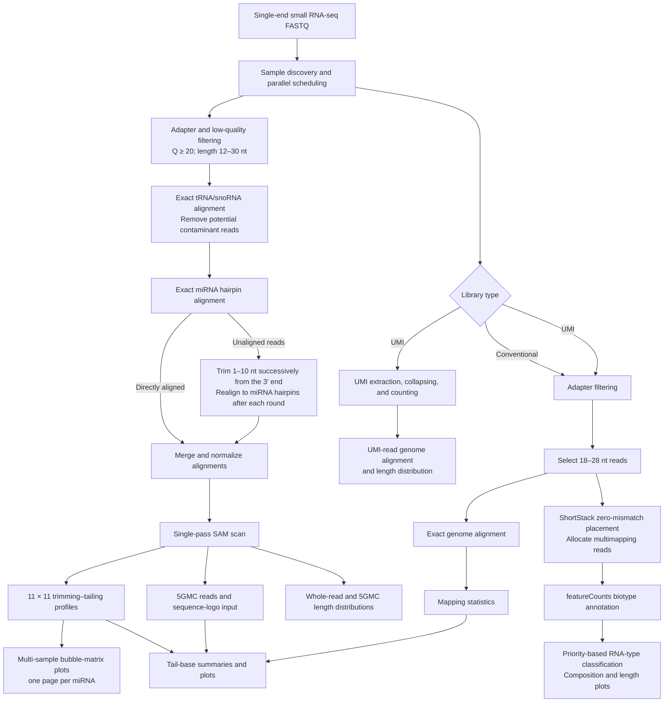
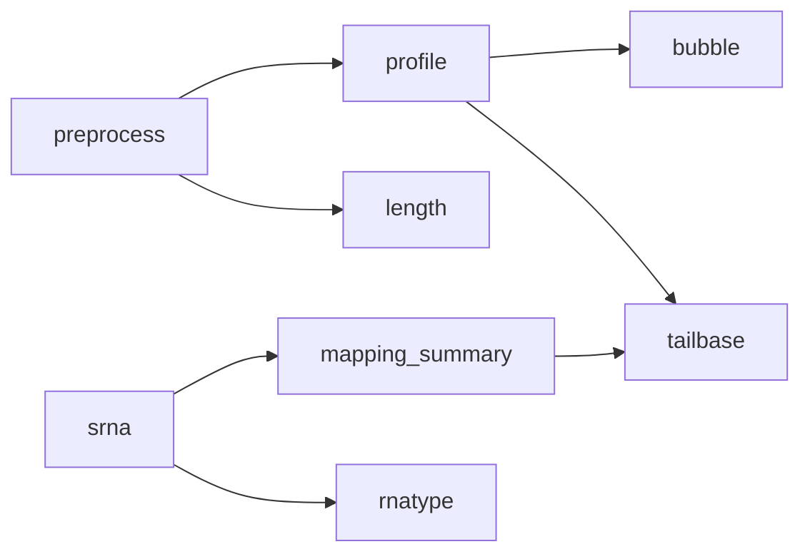

<p align="right"><a href="README.md">中文</a> | <strong>English</strong></p>

# miR3End

**A parallel workflow for profiling miRNA 3′-end trimming and tailing**

[](LICENSE)
[](VERSION)

## Overview

Non-templated tailing and nucleotide trimming at the miRNA 3′ end are important
post-transcriptional modifications that affect miRNA stability, degradation, and
functional regulation. This workflow is designed for plant single-end small RNA-seq
data. It systematically identifies and quantifies miRNA 3′-end tailing and trimming
events and describes the distributions of modification lengths, terminal nucleotide
composition, and modification patterns across samples.

The workflow first performs adapter removal, quality control, and length filtering on
raw FASTQ reads, then removes potential contaminants by exact alignment against
tRNA/snoRNA reference sequences. The filtered reads are aligned to miRNA hairpin
references. Reads that do not align directly are trimmed by 1–10 nt from the 3′ end
and realigned after each trimming round to recover miRNA reads that may contain
non-templated terminal modifications. For each miRNA, a trimming–tailing profile is
built from the original read length, trimming length, alignment start, and annotated
mature-miRNA boundaries. The workflow then summarizes 5GMC, terminal nucleotide
type, and length distributions.

In addition to miRNA terminal-modification analysis, the workflow provides genome
alignment for conventional and UMI small RNA libraries, mapping-statistics summaries,
length distributions for whole reads and 5GMC, and tail-base tables and plots.
It can also use ShortStack to place 18–28 nt reads on the genome with zero mismatches
and allocate multimapping reads, followed by featureCounts and GFF3 biotype
annotations to calculate library RNA-type composition. Sample-level parallel
scheduling is independent of per-sample thread control, making the workflow suitable
for batch analysis of multi-sample small RNA-seq projects.

This project was refactored from `renlab_tailing_trimming_20240111`. The core
statistical definitions and major analysis parameters were retained, while Python and
R logic previously spread across multiple directories was consolidated into this
repository. Repeated SAM scans were replaced with a single-pass strategy. Users
prepare Bowtie indexes and organism reference files as described in
`resources/README.md`; the repository no longer depends on the original server layout.

### Workflow



### Main outputs

- An 11 × 11 trimming–tailing profile for each miRNA
- A multi-page PDF of side-by-side, multi-sample trimming–tailing bubble matrices
- Summary statistics for total miRNA reads and 1–10 nt tailing and trimming events
- 5GMC reads and sequence-logo input files
- Length-distribution workbooks and two-panel sample PDFs for whole reads and 5GMC
- Counts, proportions, and RPM values by terminal nucleotide and modification length
- Genome alignments and mapping statistics for conventional or UMI small RNA libraries
- RNA-type counts, proportions, length distributions, and multi-sample composition plots after ShortStack placement

## Improvements over the original version

| Item | Original version | New version |
| --- | --- | --- |
| Project structure | Referenced external scripts such as `TRMRNAseqTools/0_workflow_for_srna_seq.py` at runtime | Analysis logic and R scripts are included; external reference requirements and parameters are documented in `resources/README.md` |
| Multi-sample execution | Samples were mainly processed serially | `--jobs` controls sample-level parallelism |
| Resource control | Tool thread counts were scattered across scripts | `--threads-per-sample` controls per-sample tool threads; total demand is approximately `jobs × threads-per-sample` |
| Profile calculation | Perl rescanned the SAM file once for each miRNA, for 538 complete scans | Python scans each SAM once and produces profiles, summaries, and 5GMC output together |
| Resume support | Completed steps had to be identified manually | `--resume` skips completed samples and steps based on their final outputs |
| Preflight checks | No unified preview entry point | `--dry-run` previews samples, parameters, indexes, and commands |
| External dependencies | Relied on external Python/Perl scripts and some unnecessary tools | Removes Perl, `seqkit`, and `dnapilib`; retains required software and Bowtie indexes |
| Logs and errors | Nested scripts made failures difficult to locate | A unified entry point, step logs, and sample-level error messages simplify diagnosis and reruns |

### Performance

The largest speed improvement is in the `profile` step. The old implementation
reread the SAM file for each of 538 miRNAs; the new implementation scans the SAM only
once and performs all calculations during that pass. In testing, this step processed
an approximately 1.2 GB SAM file in about 37 seconds. The profile, summary, and 5GMC
outputs from the old and new implementations were compared byte for byte and were
identical.

FASTQ and SAM files are read as streams, avoiding the need to load an entire large
file into memory. The R summary scripts were also adjusted to avoid unnecessary
expansion of sparse nucleotide statistics.

### Parallel execution

Parallelism is sample based: `--jobs` is the maximum number of samples processed
simultaneously, while `--threads-per-sample` controls the threads available to tools
such as Bowtie within each sample. For example:

```bash
python3 main.py -i 1_rawdata -o results --jobs 2 --threads-per-sample 8
```

This configuration runs at most two samples simultaneously and requires approximately
16 CPU threads in total. It improves multi-sample throughput while keeping process
creation bounded.

### Independence and reproducibility

The external small-RNA workflow, statistical logic, and R scripts used by the original
pipeline are now included in this repository, so the original server directory layout
is no longer required. Executables are resolved from the active Conda environment or
`PATH`; reference indexes and annotations are supplied through command-line options or
`MIR3END_*` environment variables. No `/bios-store1`, `/home`, or `/usr/local`
machine-specific path remains as a default. Reference requirements are documented in
`resources/README.md`; record each source, release, and checksum with the analysis.

`test/` contains synthetic minimal data and a directly runnable profile-stage smoke
test that requires neither an external genome nor an aligner. Before production use,
run a small representative sample set to confirm local software versions, indexes,
and resource configuration.

## Installation and requirements

The versioned Conda environment is recommended; `environment.yml` includes Python,
R, and command-line dependencies:

```bash
conda env create -f environment.yml
conda activate mir3end-0.1.0
python main.py --version
python test/run_smoke_test.py
```

Use `requirements.txt` for Python-only installation. The complete workflow also
requires `bowtie`, `trim_galore`, `ShortStack`, `featureCounts`, and `Rscript`; these
are resolved from `PATH` unless explicitly overridden.

## Release and citation

The current release candidate is `0.1.0`. miR3End is distributed under the
[MIT License](LICENSE), with citation metadata in [`CITATION.cff`](CITATION.cff).
The repository also includes `.zenodo.json`. After merging the release branch,
connect the repository to Zenodo and create the `v0.1.0` GitHub Release to mint a
version DOI. Add that DOI to `CITATION.cff`, this README, and the manuscript abstract.

## Quick start

```bash
python3 main.py \
  -i /path/to/1_rawdata \
  -o /path/to/project \
  --mir-hairpin /path/to/hairpin_index_prefix \
  --trsno /path/to/trsno_index_prefix \
  --genome-index /path/to/genome_index_prefix \
  --genome-fasta /path/to/genome.fa \
  --rnatype-annotation /path/to/annotation.gff3 \
  --jobs 2 \
  --threads-per-sample 8
```

Total thread demand is approximately `jobs × threads-per-sample`. Start with
`--jobs 2`, inspect memory and CPU usage, and increase it if resources allow.

Input files match `*.fastq.gz` by default. Sample names are derived by removing
`--suffix` from filenames and converting hyphens (`-`) to underscores (`_`).
For a file named `sample_R1.fastq.gz`, use:

```bash
python3 main.py -i 1_rawdata -o project_output --suffix _R1.fastq.gz
```

## Output layout

Reconstructable intermediate files are written to `work/`, while outputs intended
for inspection, statistics, and publication are written to `results/`. The two
analysis branches are separated:

```text
project_output/
├── work/
│   ├── tailing_trimming/
│   │   ├── trimmed_fasta/
│   │   └── remapping/<sample>/
│   └── srna/
│       ├── trimmed/
│       ├── umi/
│       └── genome_mapping/
└── results/
    ├── tailing_trimming/
    │   ├── profiles/
    │   ├── 5gmc/
    │   ├── sequence_logo/
    │   ├── length/
    │   │   ├── <sample>_len_dist.xlsx
    │   │   └── plots/<sample>_length_distribution.pdf
    │   ├── bubble/tailing_trimming_bubble.pdf
    │   └── tailbase/
    │       ├── tables/<sample>/
    │       ├── plots/<sample>/
    │       └── workspace/
    └── srna/
        ├── mapping_summary.tsv
        └── rnatype/
            ├── rnatype_summary.tsv
            ├── rnatype_summary.xlsx
            ├── tables/<sample>_rnatype_by_length.tsv
            └── plots/
                ├── rnatype_composition.pdf
                ├── rnatype_composition.png
                └── <sample>_rnatype_by_length.pdf
```

`--layout auto` is the default. New projects use the layout above; if legacy
`3_remapping/` or `4_163.results/` directories are detected, the existing layout
is retained to avoid duplicated computation. You can explicitly select
`--layout organized` or `--layout legacy`.

## Steps, functions, and result interpretation

The workflow consists of eight steps. “Direct plots” in the table indicates only
whether the step itself creates a figure; steps without direct plots usually generate
standardized inputs for downstream statistics and visualization.

| Step | Main function | Required input | Direct plots |
| --- | --- | --- | --- |
| `preprocess` | miRNA-branch QC, contaminant filtering, and iterative 3′ remapping | Raw FASTQ | FastQC HTML |
| `profile` | Build 11 × 11 trimming–tailing matrices, summaries, 5GMC, and sequence-logo input | `preprocess` | None |
| `bubble` | Plot multi-sample trimming–tailing bubble matrices by miRNA | `profile` | Multi-page PDF |
| `srna` | Conventional/UMI library processing, 18–28 nt selection, and genome alignment | Raw FASTQ | FastQC HTML |
| `mapping_summary` | Summarize total reads, mapped reads, and alignment rates from Bowtie logs | `srna` | None |
| `rnatype` | ShortStack placement, featureCounts annotation, and unique RNA-type classification | `srna` | RNA-type composition and length plots |
| `length` | Calculate whole-read and 5GMC length distributions | `preprocess` | Embedded Excel charts and sample PDFs |
| `tailbase` | Summarize trimming, overall tailing, and non-templated tailing lengths and nucleotide composition | `profile`, `mapping_summary` | Two PDFs per sample |



All images below were generated from fixed, anonymized demonstration data. They
illustrate plot structure only and do not represent real samples or expected
biological distributions. Run `python3 docs/generate_demo_figures.py` to regenerate
the README examples.

### 1. `preprocess`: miRNA terminal-modification preprocessing and remapping

This step uses Trim Galore to remove adapters, low-quality bases, and reads containing
`N`, retaining sequences 12–30 nt long. Reads are first aligned exactly to
tRNA/snoRNA references to remove potential contaminants, then aligned exactly to
miRNA hairpins. Unaligned sequences are successively trimmed by 1–10 nt from the 3′
end and realigned. The final alignments, including trimming information, are merged
into a SAM file used by profile and length analyses.

```bash
python3 main.py -i 1_rawdata -o project_output --steps preprocess -j 2
```

Main outputs:

- `work/tailing_trimming/trimmed_fasta/<sample>_trimmed_fastqc.html`: post-adapter-removal FastQC report
- `work/tailing_trimming/trimmed_fasta/<sample>_trimmed.fasta`: formatted reads
- `work/tailing_trimming/remapping/<sample>/merged-alignment-sorted.sam`: core merged alignment
- `work/tailing_trimming/remapping/<sample>/remapping.log`: tRNA/snoRNA and miRNA alignment log

FastQC reports are used to inspect base quality, adapter remnants, sequence lengths,
and overrepresented sequences. The simplified README example is shown below; open
each sample's interactive HTML report for production analysis.


### 2. `profile`: trimming–tailing matrices and 5GMC extraction

This step scans each sample's merged SAM once. Using mature-miRNA start and end
coordinates, it assigns reads to an 11 × 11 matrix of 0–10 nt trimming and 0–10 nt
tailing. It also extracts 5′ genomic matching component (5GMC) reads and generates
sequence-logo inputs and miRNA-level count summaries.

```bash
python3 main.py -o project_output --steps profile --resume
```

Main outputs:

- `results/tailing_trimming/profiles/<sample>.txt`: complete sample profile
- `results/tailing_trimming/profiles/<sample>.summary.txt`: totals and 1–10 nt trimming/tailing summaries
- `results/tailing_trimming/profiles/<sample>/<miRNA>.txt`: 11 × 11 matrix for one miRNA
- `results/tailing_trimming/5gmc/<sample>.5GMC`: 5GMC reads
- `results/tailing_trimming/sequence_logo/<sample>/`: sequence-logo input for each miRNA

This step does not create plots directly. Individual miRNA matrices are visualized by
`bubble`; 5GMC data are used by `length` and `tailbase`.

### 3. `bubble`: multi-sample trimming–tailing bubble plots

This step plots the 11 × 11 profiles of the same miRNA side by side across samples.
The x-axis is trimming length, the y-axis is tailing length, and circle area represents
the relative read proportion of that combination within the current miRNA profile.
Each PDF page represents one miRNA.

```bash
python3 main.py \
  -o project_output \
  --steps bubble \
  --filelist filelist \
  --bubble-cols 2
```

The main output is
`results/tailing_trimming/bubble/tailing_trimming_bubble.pdf`.
`--bubble-cols` controls the number of samples per row, and `--bubble-output`
overrides the output path.


### 4. `srna`: small RNA library processing and genome alignment

For conventional libraries, this step removes adapters, retains 18–28 nt reads, and
aligns them to the genome with Bowtie using zero mismatches. For UMI libraries, it
also recognizes the linker, extracts 12 nt UMIs, collapses identical insert–UMI
combinations, and separately outputs UMI-read alignments and length statistics.
`--umi-flag 1` selects a UMI library; the default `2` selects a conventional
library.

```bash
python3 main.py -i 1_rawdata -o project_output --steps srna --umi-flag 2 -j 2
```

Main outputs:

- `work/srna/trimmed/<sample>_trimmed_fastqc.html`: small-RNA branch FastQC report
- `work/srna/genome_mapping/<sample>_trimmed_len.fq.gz`: 18–28 nt reads
- `work/srna/genome_mapping/<sample>_aligned.sam`: genome alignment
- `work/srna/genome_mapping/<sample>.mapresults.txt`: Bowtie alignment log
- In UMI mode: `work/srna/umi/<sample>_umi.fa.gz`, alignments, and `<sample>_umi_dist.csv`

The direct visual output remains the FastQC HTML report. UMI length output is a
TSV/CSV table and is not automatically rendered as a PDF.

### 5. `mapping_summary`: genome-mapping summary

This step parses Bowtie logs for all samples and summarizes input reads, reads aligned
at least once, alignment rate, and Bowtie-reported alignments. It supports project-level
quality control and provides one of the normalization inputs for `tailbase`.

```bash
python3 main.py -o project_output --steps mapping_summary
```

The main output is `results/srna/mapping_summary.tsv`, with the columns `Sample`,
`Total_reads`, `Mapped_reads`, `Mapped_rate(%)`, and `Reported`. This step does
not plot directly, allowing users to create cross-sample QC figures appropriate to
their experimental design.

### 6. `rnatype`: RNA-type classification and composition plots

This step uses ShortStack for zero-mismatch placement and multimapping allocation of
18–28 nt reads, followed by featureCounts annotation using the GFF3 `biotype`
attribute. A predefined priority assigns each placed read to one unique RNA type.
Plot colors correspond directly to legend categories, stacks follow the legend order
from top to bottom, and all y-axes use `Percentage (%)`.

```bash
python3 main.py \
  -i 1_rawdata \
  -o project_output \
  --steps srna,rnatype \
  --jobs 2 \
  --threads-per-sample 8
```

Main outputs:

- `results/srna/rnatype/rnatype_summary.tsv` and `.xlsx`: cross-sample RNA-type summary
- `results/srna/rnatype/tables/<sample>_rnatype_by_length.tsv`: per-sample classification by read length
- `results/srna/rnatype/plots/rnatype_composition.pdf` and `.png`: overall multi-sample composition
- `results/srna/rnatype/plots/<sample>_rnatype_by_length.pdf`: length-resolved sample composition


### 7. `length`: whole-read and 5GMC length distributions

This step calculates original read lengths and corresponding 5GMC lengths from the
miRNA remapping SAM, using total mapped miRNA reads as the denominator. Each sample
produces an Excel workbook and a two-panel PDF to show whether complete reads and
their genomic matching components have different length peaks.

```bash
python3 main.py -o project_output --steps length --resume
```

Main outputs:

- `results/tailing_trimming/length/<sample>_len_dist.xlsx`
- `results/tailing_trimming/length/plots/<sample>_length_distribution.pdf`

The workbook contains `total reads mapped to miRNA`,
`distribution of whole reads`, and `distribution of 5GMC` worksheets, with two
charts embedded on the first sheet. If an older workbook exists without charts,
`--steps length --resume` can add them from existing statistics without rescanning
the SAM.


### 8. `tailbase`: terminal nucleotide and modification-length summaries

This step integrates profile summaries, 5GMC, mapping summaries, and miRNA annotations
to calculate lengths, A/T/C/G composition, percentages, and RPM for trimming, overall
tailing, and non-templated tailing. The overall plot includes all inferred tailing
events; the non-templated plot additionally excludes templated extensions matching
the reference sequence.

```bash
python3 main.py -o project_output --steps tailbase --resume
```

Main outputs:

- `results/tailing_trimming/tailbase/tables/<sample>/<sample>_tail_summary.xlsx`
- `results/tailing_trimming/tailbase/tables/<sample>/<sample>_tail_nt_summary.xlsx`
- `results/tailing_trimming/tailbase/tables/<sample>/<sample>_trim_summary.xlsx`
- `results/tailing_trimming/tailbase/plots/<sample>/<sample>_tailing_trimming_length.pdf`
- `results/tailing_trimming/tailbase/plots/<sample>/<sample>_tailing_trimming_nt_length.pdf`


When continuing from an existing
`work/tailing_trimming/remapping/<sample>/`, raw FASTQ input may be omitted, or
samples may be specified with `--filelist`. Legacy directories remain supported
through `--layout legacy`. `--resume` skips completed tasks based on each step's
final outputs; `--dry-run` checks samples, parameters, indexes, and planned commands.

### RNA-type classification rules and configurable parameters

The `rnatype` step reuses 18–28 nt FASTQ files produced by `srna`. ShortStack uses
zero mismatches, `mmap=u`, `bowtie_m=1000`, and `ranmax=50`, matching the legacy
`0_workflow.sh`. featureCounts then annotates `gene,ncRNA_gene` features using the
GFF3 `biotype` attribute. Overlapping annotations are assigned one unique RNA type
in this priority order: primary miRNA transcript, phasi/tasiRNA, hc-siRNA,
transposable element, lncRNA, protein-coding, snoRNA, snRNA, rRNA, and tRNA. Reads
that do not align to the genome are excluded from the denominator; aligned reads
without matching annotations are classified as `unassigned`.

```bash
python3 main.py \
  -i 1_rawdata \
  -o project_output \
  --steps srna,rnatype \
  --jobs 2 \
  --threads-per-sample 8
```

If the length-filtered `srna` outputs already exist, run only
`--steps rnatype --resume`. TAIR10 is the default reference; replace it using
`--genome-fasta` and `--rnatype-annotation`. featureCounts retains the legacy
unstranded default `--rnatype-stranded 0`. If library orientation has been confirmed
by experimental design or an independent check, use `1` for forward or `2` for
reverse. Supply a custom overlap priority with `--rnatype-priority`, one category per
line in descending priority.

## Repository contents

```text
main.py                    Unified entry point and step scheduler
pipeline/                  Python implementation with controlled sample-level parallelism
pipeline/bubble.py         Multi-sample trimming–tailing bubble-matrix plots
pipeline/rnatype.py        ShortStack/featureCounts RNA-type classification and plots
assets/tail_base_summary.R Local R summary script
docs/                      Anonymized README examples and reproducible generator
resources/                 Local R/Python reference tables (ignored by Git)
requirements.txt           Python dependencies
```

Default Arabidopsis Bowtie indexes can be overridden with `--mir-hairpin`, `--trsno`,
and `--genome-index`. Run `python3 main.py --help` for all options.

## Supplement: normalization and interpretation of trimming–tailing diagonals

### S1. Statistics and denominators

Raw counts, within-profile percentages, and RPM answer different questions and are
not interchangeable. Let `C(s,m,t,a)` be the read count in sample `s` for miRNA
(or identical mature-sequence family) `m`, trimming length `t`, and tailing length
`a`.

| Method | Calculation | Main use | Limitations and recommendation |
| --- | --- | --- | --- |
| Raw count | `C(s,m,t,a)` | Inspect the actual read support for a modification state | Depends on library depth and is unsuitable alone for cross-sample quantification; always inspect it with percentages or RPM |
| Original GitHub bubble area | `C(s,m,t,a) / sum(t,a) C(s,m,t,a) × 1500` | Compare the trimming–tailing composition of one miRNA within a sample | The denominator is the miRNA's complete 11 × 11 profile. This is a within-profile proportion, not RPM. A few reads from a low-abundance miRNA can still produce a large bubble and do not demonstrate absolute abundance recovery |
| Percentage of all reads | `100 × C / all allocated reads for the mature-sequence family` | Show the complete composition of canonical and modified states | Recommended for bubble color; answers “what proportion of this miRNA has this modification?” |
| Modified-only percentage | `100 × C / all modified reads for the family`, excluding `(0,0)` | Magnify the distribution among modified reads | Does not compare modifications with canonical reads; unstable at low modified raw counts and must be reported with raw counts |
| All-miRNA RPM | `10^6 × C / all allocated miRNA reads in the sample` | Compare miRNA or modification-state abundance across samples | Recommended primary quantitative denominator. It does not depend on ShortStack RNA-type annotation, but changes in the global miRNA pool under HEN1 loss still require inspection |
| PTGS-proxy RPM | `10^6 × C / phasi_tasiRNA reads` | Test whether conclusions depend on the all-miRNA denominator | Sensitivity analysis only; `phasi_tasiRNA` is an available PTGS-siRNA proxy, not the complete PTGS-siRNA population |
| rRNA-derived RPM | `10^6 × C / rRNA reads` | A second external-reference denominator for sensitivity analysis | Sensitive to rRNA degradation, contamination, and library preparation; not recommended as the sole primary result |
| Combined stable-pool RPM | `10^6 × C / (all-miRNA + phasi/tasiRNA + rRNA-derived reads)` | Provide a cross-sample abundance scale for bubble area | Recommended for candidate-bubble area; retain within-family percentage as color to show both composition and abundance |

In experiments where `nrpd1` causes a global collapse of hc-siRNAs, total small-RNA
reads or hc-siRNA totals should not be the primary denominator. The denominator's
large biological shift would artificially inflate other RNA categories. Recommended
practice is:

1. Use **all-miRNA RPM** as the primary cross-sample abundance result.
2. Report denominator sensitivity using PTGS-proxy RPM, rRNA-derived RPM, and combined stable-pool RPM.
3. Use within-family percentage for bubble color and combined stable-pool RPM for area, retaining raw count beside the plot.
4. Treat a conclusion as robust to normalization only when effect direction and candidate ranking agree across denominators.

The current descriptive comparison does not use edgeR/TMM and does not calculate
P-values or FDR. First calculate RPM from raw counts using the reference pools above,
then calculate mean RPM for each biological group. Define between-group fold change
as `log2(mean RPM_A / mean RPM_B)`. Without a pseudocount, retain `Inf`, `-Inf`,
or `NaN` produced by zero means, and report group raw counts and replicate
dispersion. `|log2FC| >= 1` indicates a descriptive change of at least twofold, not
statistical significance.

### S2. Meaning of diagonal points

In a bubble plot, the x-axis is trimming length and the y-axis is tailing length.
Therefore, a diagonal point `trimming = tailing = k` means that `k` reference
nucleotides are missing from the mature miRNA 3′ end and `k` nucleotides are added
to the read end. If the 5′ start is unchanged, the read has the same total length as
the annotated mature miRNA. This can be called “length-compensated trim-and-tail” or
“3′-end replacement.” For example, a mature sequence ending in `...ACGA` and a read
ending in `...ACUU` may be recorded as `(trim=2, tail=2)`.

A diagonal signal is not automatically evidence of a true biological modification.
The current workflow first requires zero-mismatch alignment to a hairpin. Unaligned
reads are then trimmed successively by 1–10 nt from the 3′ end and realigned with zero
mismatches. Consequently, a read with the same length as the mature miRNA but `k`
consecutive terminal mismatches naturally falls at `(k,k)`. Diagonal signals may be
a mixture of:

- True trimming followed by non-templated tailing; this is biologically plausible in a `hen1` background when U-rich and altered as expected by the `heso2` genotype
- 3′-end sequencing errors or low terminal quality, especially at `(1,1)`
- Mature-miRNA boundary annotation errors, alternative DCL processing, or terminal differences among homologous family members
- Adapter remnants, or templated hairpin/genome extensions misclassified as non-templated tails
- Bowtie `-a` multimapping, which can count one read against multiple related hairpins and reinforce the same pattern
- Visual amplification of low raw-count cells by within-profile percentage scaling

### S3. Criteria for diagonal interpretation and reporting

For each candidate diagonal cell, extract the original read sequences and actual tail
sequences, then evaluate them using the following criteria.

| Check | More supportive of genuine trim-and-tail | More supportive of a technical or algorithmic artifact |
| --- | --- | --- |
| Tail composition | U-rich or shows a clear enzyme preference | Mixed bases or enriched adapter motif |
| Genotype direction | Enriched in `hen1` and changes as expected in the `heso2` background | Similar in WT and all mutants |
| Tissue and phenotype | Inflorescence changes agree with fertility recovery and leaf differences are weaker | Tissue and phenotype directions disagree |
| Biological replicates | Multiple replicates agree and raw counts are sufficient | Driven by one replicate or only a few reads |
| 3′ base quality | Normal terminal quality | Clear terminal-quality decline, especially for `(1,1)` |
| Precursor/genome check | Tail is absent from the corresponding hairpin or genomic extension | The apparent tail can be explained by the template |
| Alternative alignment | Signal remains with limited mismatches or explicit 3′-end parsing | Diagonal collapses when the exact-match strategy changes |
| Family and multimapping | Remains after merging identical mature-sequence families and constraining each read's total weight to 1 | Appears only across duplicated annotation members |

At minimum, report diagonal raw count, percentage of all family reads, percentage of
modified reads, RPM, tail nucleotide composition, and all three biological
replicates. Two additional summary metrics may be used:

```text
Diagonal fraction = sum(k >= 1) C(trim=k, tail=k) / all modified reads
U-diagonal fraction = U-tailed reads on the diagonal / all diagonal reads
```

A diagonal point should be treated as candidate molecular recovery evidence only when
raw counts are sufficient, replicates are stable, tails are U-rich, templated
extensions have been excluded, and genotype and tissue changes agree with the
phenotype. An isolated `(1,1)` point or a point supported only by a large
within-profile bubble should be prioritized for validation rather than interpreted
directly as a biological conclusion.
